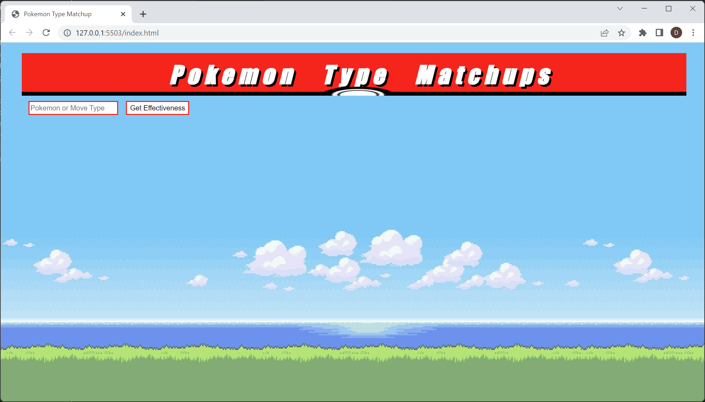
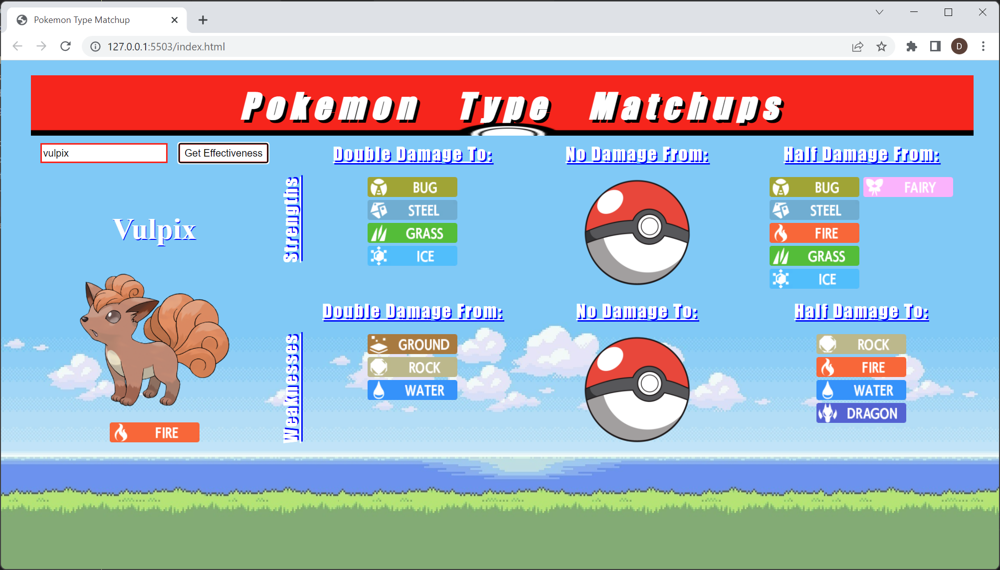
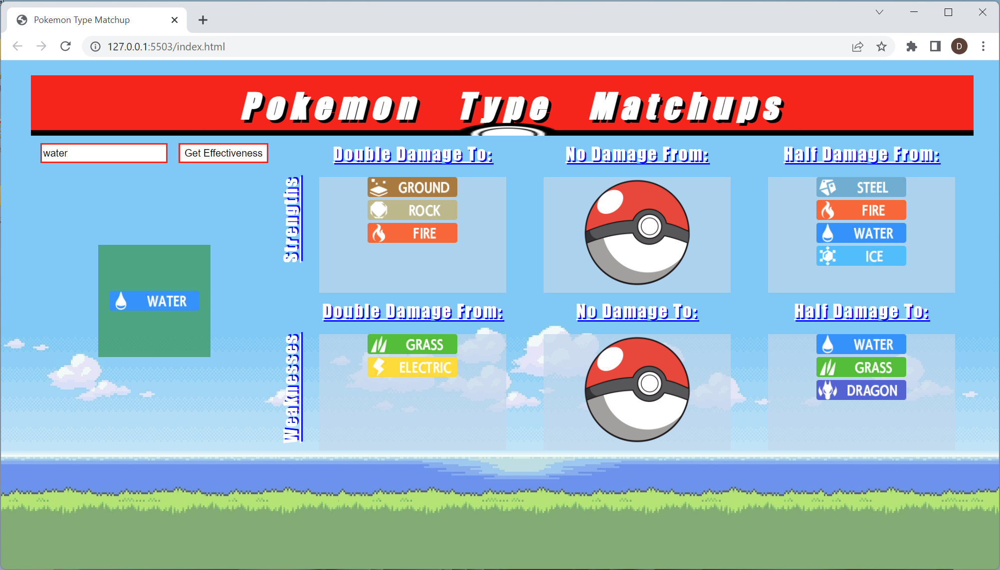

# Pokemon Type Matchups

---

[Pokemon Type Matchup](https://jazzy-donut-9455c5.netlify.app/)

An application that populates type effectiveness based on user entered pokemon or type 
Created from personal desire to use the app to for easy reference during the times I play any game in the Pokemon franchise 

## Technologies Used

---

- HTML5
- CSS3
- JavaScript
- jQuery
- jQuery UI
- Pokemon API

## Screenshots

---

### Future Enhancements

---

- The ability to click on a icon and start a new search
- Links that will lead to a list of Pokemon that have a selected typing
- Links that will lead to a list of moves that have a selected typing
- Dryer code
- CSS tweeks
- Mobile/resizing functionality
- Users can click on a list of typings to search 
- Users can click on returned typings from a search to trigger a new search 